## 面向神经网络训练加速器S2Train的编译器

### 简介

本科毕设。面向神经网络训练加速器的编译器。以PyTorch模型为输入，输出粗粒度指令和数据。

编译期间可以完成自动微分、形状推断、算子融合、算子调度、静态内存规划等工作。

### 整体架构

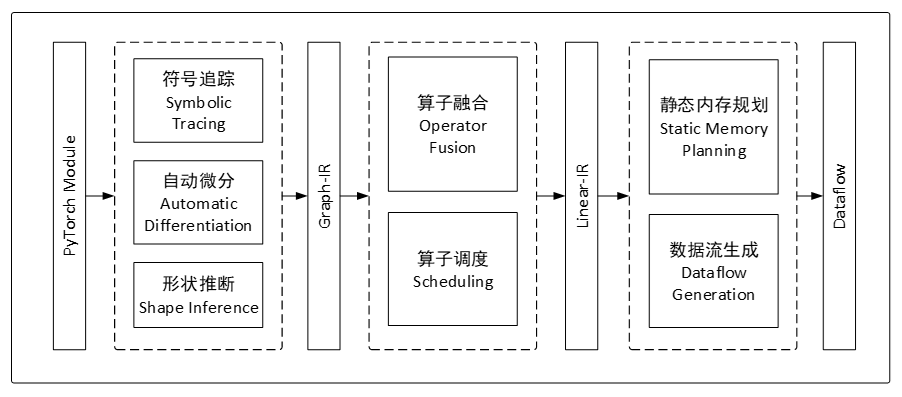

### 获取计算图

利用torch.fx获取计算图

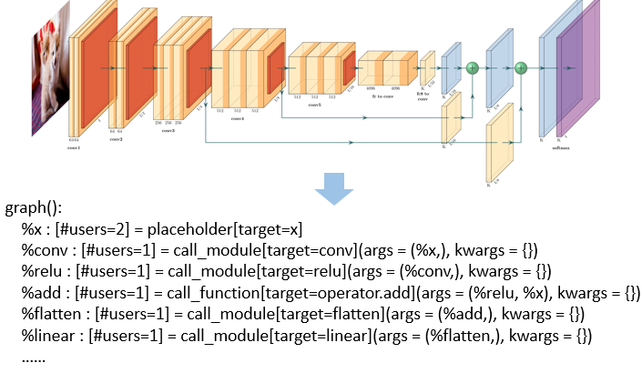

### 转换为Graph-IR

- **目的**：torch.fx直接导出的计算图不方便进一步处理，故转换为更干净的中间表示，这里称之为GraphIR。
- **算子对应关系**：下面是一个torch.fx到Graph-IR的算子对应关系的示意图。同一个算子，在pytorch中不同的调用方式，会在torch.fx中生成不同的节点；在Graph-IR中会统一表示。

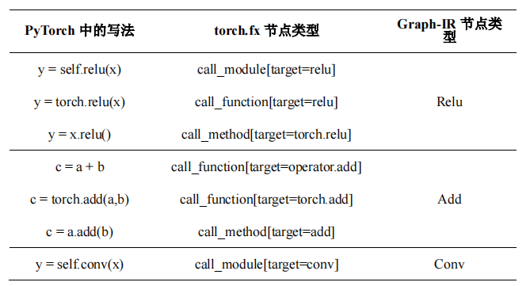

### 自动微分

- **目的**：在构建Graph-IR的同时，构建其反向图，实现自动微分的效果。
- **方法**：
  - 为各个算子提前定义好其反向算子；
  - 算子包含权重时，额外创建权重梯度计算算子和梯度更新算子；
  - 遇到分叉，在反向图里添加梯度相加算子
  - 遇到残差连接，反向图里无需添加算子。

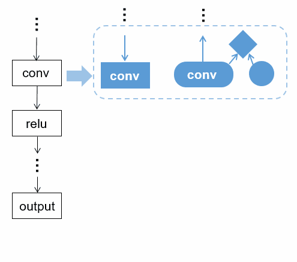

### Graph-IR 结构

- **类别**：Graph-IR中的节点分为三类，分别为算子（蓝色）、张量（黄色）和数据（绿色）。
- **算子**：前传算子、特征图梯度算子、权重梯度算子、权重更新算子
- **张量**：不存储具体数据，只维护一个指向数据的指针，以及张量的metadata。张量可被多个算子共享。
  - metadata包含形状（shape）、步长（stride）、偏移（offset），与pytorch和numpy中的含义一致
  - 对张量进行转置（transpose）、切片（slice）、变形（shape）等操作时，只需修改metadata即可。
- **数据**：存储张量内具体的数据。数据可被多个张量共享。

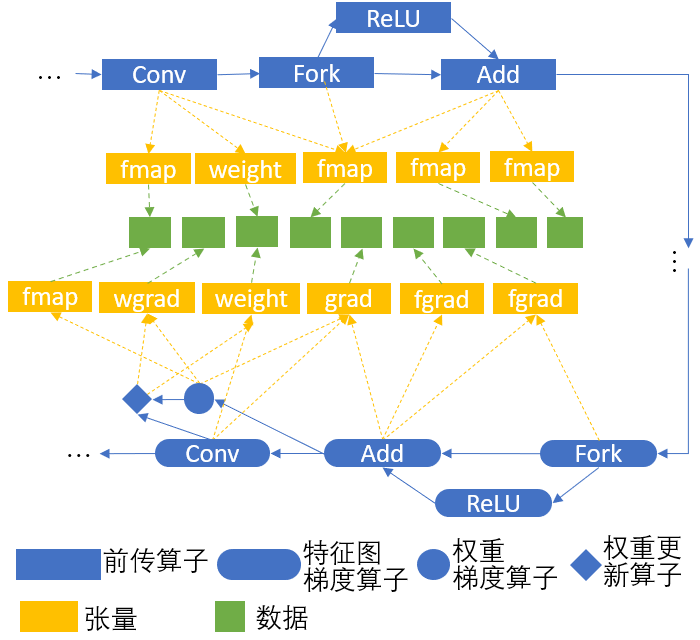

### 形状推断

用户指定输入图片大小后，编译器自动推导出每个算子的输入、输出特征图张量的形状。

设定好每个算子的形状推导规则，然后按拓扑序依次推导。

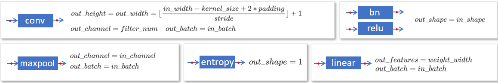

### 算子融合

- **目的**：S2Train加速器支持一次计算多个算子（PE完成卷积/全连接层计算，输出直接给到PPU完成激活函数计算），中间结果无需写回内存。对Graph-IR执行算子融合，可省去中间结果的内存读写，提升执行速度。

- **搜索**：基于DFS，找到所有不重叠的、加速器支持的算子组合

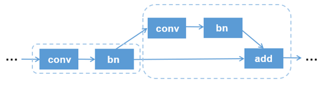

- **替换**：使用融合算子，替换掉搜索到的算子组合

- **非法情况**：非法的算子融合会在DAG中产生环。提前按拓扑序遍历一遍算子，为算子标记时间戳，保证前驱节点时间戳<后继节点时间戳

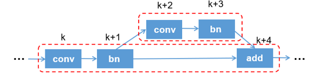

### 算子调度

- **目的**：不同的调度顺序会带来不同的内存峰值。通过一定调度策略，减小内存占用。

- **策略**：提供了两种策略，最后更新权重和立即更新权重。后者会带来更小的内存占用。
- **结果**：DAG图被赋予了确定的执行顺序

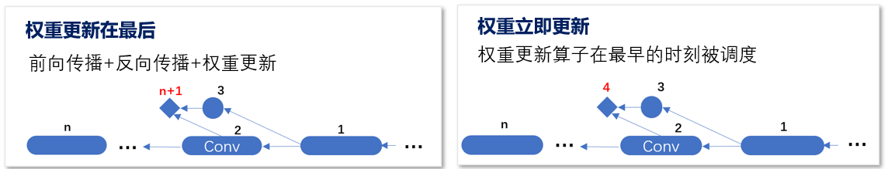

### 静态内存规划

- **目的**：在编译阶段，为每个张量分配内存地址；使生命周期不重叠的张量能够复用内存，以减小训练期间的内存峰值

- **张量生命周期分析**：
  - **特征图**：在前向传播中开始；在反向传播到对应的算子时，计算权重梯度后结束
  - **权重梯度**：在反向传播中开始；在权重更新后结束
  - **特征图梯度**：在反向传播中开始，用于计算出下一层的特征图梯度和权重梯度；用完后生命周期结束

- **解决思路**：
  - **二维装箱问题**：将张量内存分配的问题看作二维装箱问题的特殊形式，如下图所示。
  - **坐标轴含义**：横轴为时间，单位为执行步骤；纵轴为内存地址，单位为字节。
  - **张量**：图中矩形代表张量，蓝色为特征图，绿色为特征图梯度，红色为权重梯度。
  - **搜索空间**：由于各张量生命周期已确定，故矩形的横坐标范围不可变；通过调整各矩形纵坐标，使各矩形不重叠（互不侵占内存）的情况下，总高度（内存峰值）最小。

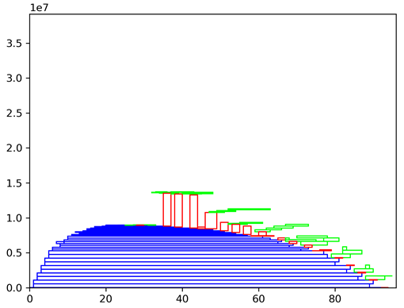

- **优化策略**：下面是四个示例，分别为：1.无内存复用；2.梯度之间复用；3.使用权重立即更新策略；4.随机搜索，充分挖掘各类张量的复用。
  - **配置**：ResNet18，batch size=4，image_size=32。这里仅考虑了特征图、特征图梯度和权重梯度这三类张量

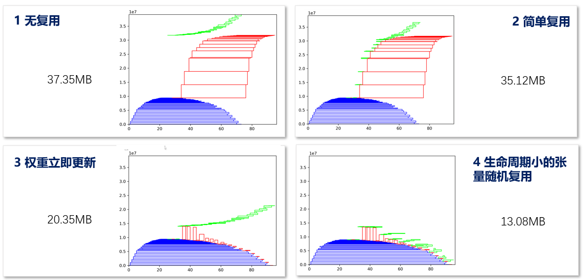

### 指令与数据生成

将指令和数据打包在一起。
