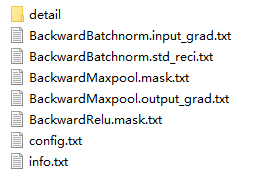
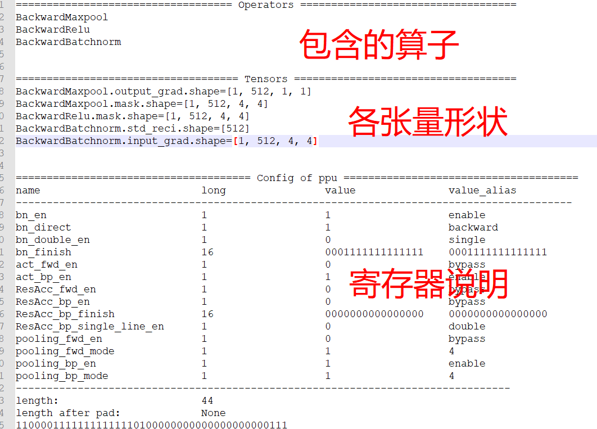

# PPU测试数据

info.txt里是有关测试数据的说明

config.txt里是寄存器配置

其他txt文件是ppu涉及的输入、输出张量的具体数据，文件名中的一些缩写含义如下：

| 缩写        | 含义           |
| ----------- | -------------- |
| output_grad | 输出特征图梯度 |
| input_grad  | 输入特征图梯度 |
| std_reci    | 标准差倒数     |
| std         | 标准差         |

detail文件夹是全部涉及到的张量。也就是说除了上述张量，还包含了中间结果。或许可以帮助调试用。